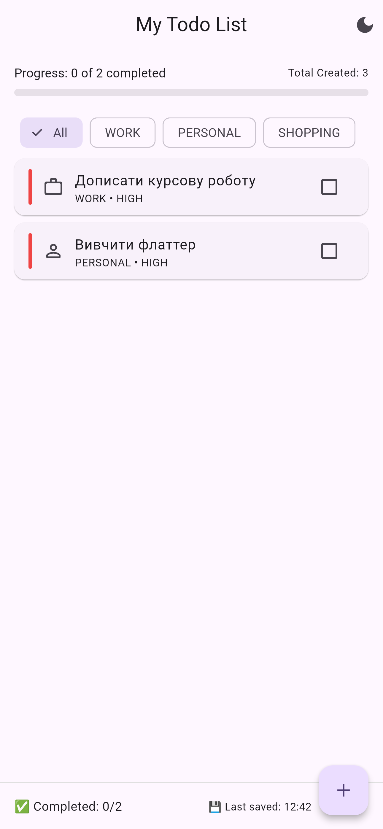
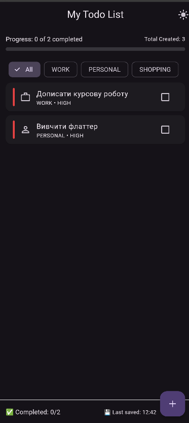
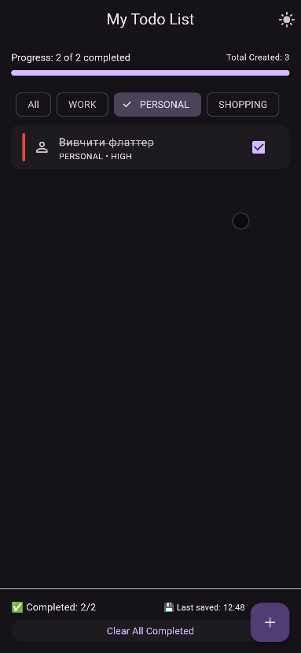
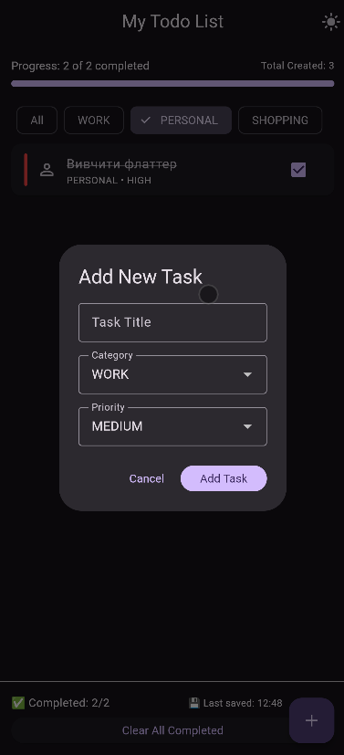

# Лабораторна робота №9: Локальне зберігання даних
**Виконав:** Маринич Данило

---

## 📱 Про проєкт
Цей застосунок є логічним продовженням розробки To-Do List. Головна мета проєкту — навчитися працювати з локальним сховищем пристрою за допомогою пакета `shared_preferences`, реалізувати персистентність (постійність) даних, щоб задачі та налаштування користувача не зникали після перезапуску додатку.

### Виконані вимоги:
- ✅ **Підключення залежностей:** Додано пакет `shared_preferences` для роботи з локальною пам'яттю (Key-Value storage).
- ✅ **Серіалізація даних (JSON):** Модель `Task` повністю підготовлена до збереження. Реалізовано методи `toJson()` для конвертації об'єкта в словник та фабрику `fromJson()` для зворотного парсингу з обробкою `DateTime`.
- ✅ **Storage Service:** Створено виділений сервіс на основі патерну **Singleton** для централізованого доступу до пам'яті.
- ✅ **Автозбереження:** Будь-яка мутація даних (додавання, виконання, видалення, очищення списку) автоматично тригерить запис у пам'ять телефону без необхідності натискати окрему кнопку "Зберегти".
- ✅ **Реактивна зміна теми:** Налаштування світлої/темної теми зберігається в `shared_preferences` та миттєво застосовується по всьому додатку за допомогою `ValueNotifier` та `ValueListenableBuilder`.
- ✅ 🌟 **Додаткове завдання (Варіант A):** Додано категорії завдань (`Work`, `Personal`, `Shopping`) з відповідними іконками. Вони зберігаються в JSON як індекси (enum) та дозволяють фільтрувати список на головному екрані.
- ✅ 🌟 **Додаткове завдання (Варіант B):** Додано систему статистики. Реалізовано збереження загальної кількості створених задач за весь час існування додатку (`totalTasksCreated`) та відображення точного часу останнього збереження даних.

---

## 🏗 Архітектура проєкту
Проєкт дотримується **Feature-based** підходу з чітким розділенням бізнес-логіки та UI:

- `lib/core/` — ядро застосунку:
  - `theme.dart` — конфігурація кольорів для світлої та темної тем.
  - `services/storage_service.dart` — інкапсульована логіка взаємодії з `SharedPreferences` (читання/запис).
- `lib/features/todo/` — функціонал списку завдань:
  - `models/task.dart` — імутабельна модель задачі (immutable data class) з `copyWith` та конвертацією в JSON.
  - `screens/todo_screen.dart` — головний екран, який керує станом (`_tasks`, `_isLoading`) та зв'язує UI зі StorageService.
  - `widgets/` — декомпозовані UI-віджети (`task_tile.dart`, `add_task_dialog.dart`, `statistics_bar.dart` тощо).
- `lib/main.dart` — точка входу, ініціалізація `WidgetsFlutterBinding` та прослуховування стану теми.

---

## 🎓 Відповіді на ключові питання

**1. Навіщо потрібен `WidgetsFlutterBinding.ensureInitialized()` у `main()`?**
Оскільки ми звертаємося до `SharedPreferences` ще до того, як викликаний `runApp()`, нам потрібно взаємодіяти з нативним кодом (платформними каналами) платформи (iOS/Android). Цей метод гарантує, що рушій Flutter повністю ініціалізований і готовий до роботи з плагінами. Без нього додаток просто впаде з помилкою при старті.

**2. Чому ми зберігаємо об'єкти як JSON-стрічку?**
`SharedPreferences` підтримує збереження лише простих типів даних: `int`, `double`, `bool`, `String` та `List<String>`. Він не вміє зберігати складні об'єкти (як наш `List<Task>`). Тому ми перетворюємо масив об'єктів у масив словників (Map), а потім кодуємо його у звичайний текст (JSON String) за допомогою `jsonEncode()`. При завантаженні робимо зворотну операцію.

**3. Навіщо використовувати патерн Singleton для `StorageService`?**
Це гарантує, що в пам'яті програми існує лише **один** екземпляр класу `StorageService`, до якого звертаються з будь-якого екрану. Це захищає нас від зайвих витрат пам'яті на створення нових об'єктів та можливих конфліктів асинхронного доступу до файлової системи.

**4. Що таке метод `copyWith` і навіщо він моделі даних?**
За правилами хорошої архітектури (і щоб уникнути багів зі станом), поля моделі мають бути незмінними (`final`). Ми не можемо просто зробити `task.isDone = true`. Натомість ми створюємо **нову** копію задачі за допомогою методу `copyWith`, передаючи туди лише ті поля, які хочемо змінити. Це гарантує цілісність даних (Immutability).

**5. У чому різниця між `SharedPreferences` та базою даних (напр. SQLite)?**
`SharedPreferences` (або `NSUserDefaults` на iOS) — це просте Key-Value сховище. Воно працює дуже швидко, але підходить лише для невеликих обсягів даних (налаштування, токени сесій, прості списки). Якщо ж даних стає багато, або потрібні складні вибірки, фільтрації та зв'язки (наприклад, знайти всі задачі за 2024 рік, які мають пріоритет High), потрібно використовувати повноцінну БД на кшталт SQLite або Isar.

---

## 📸 Скріншоти

